# Projects and dependencies analysis

This document provides a comprehensive overview of the projects and their dependencies in the context of upgrading to .NETCoreApp,Version=v10.0.

## Table of Contents

- [Executive Summary](#executive-Summary)
  - [Highlevel Metrics](#highlevel-metrics)
  - [Projects Compatibility](#projects-compatibility)
  - [Package Compatibility](#package-compatibility)
  - [API Compatibility](#api-compatibility)
- [Aggregate NuGet packages details](#aggregate-nuget-packages-details)
- [Top API Migration Challenges](#top-api-migration-challenges)
  - [Technologies and Features](#technologies-and-features)
  - [Most Frequent API Issues](#most-frequent-api-issues)
- [Projects Relationship Graph](#projects-relationship-graph)
- [Project Details](#project-details)

  - [DataServer\DataServer.csproj](#dataserverdataservercsproj)
  - [DfsShell\DfsShell.csproj](#dfsshelldfsshellcsproj)
  - [DfsWeb\DfsWeb.csproj](#dfswebdfswebcsproj)
  - [JetShell\JetShell.csproj](#jetshelljetshellcsproj)
  - [JetWeb\JetWeb.csproj](#jetwebjetwebcsproj)
  - [JobServer\JobServer.csproj](#jobserverjobservercsproj)
  - [NameServer\NameServer.csproj](#nameservernameservercsproj)
  - [Ookii.Jumbo.Dfs\Ookii.Jumbo.Dfs.csproj](#ookiijumbodfsookiijumbodfscsproj)
  - [Ookii.Jumbo.Generator\Ookii.Jumbo.Generator.csproj](#ookiijumbogeneratorookiijumbogeneratorcsproj)
  - [Ookii.Jumbo.Jet.Samples\Ookii.Jumbo.Jet.Samples.csproj](#ookiijumbojetsamplesookiijumbojetsamplescsproj)
  - [Ookii.Jumbo.Jet\Ookii.Jumbo.Jet.csproj](#ookiijumbojetookiijumbojetcsproj)
  - [Ookii.Jumbo.Test.Tasks\Ookii.Jumbo.Test.Tasks.csproj](#ookiijumbotesttasksookiijumbotesttaskscsproj)
  - [Ookii.Jumbo.Test\Ookii.Jumbo.Test.csproj](#ookiijumbotestookiijumbotestcsproj)
  - [Ookii.Jumbo\Ookii.Jumbo.csproj](#ookiijumboookiijumbocsproj)
  - [TaskHost\TaskHost.csproj](#taskhosttaskhostcsproj)
  - [TaskServer\TaskServer.csproj](#taskservertaskservercsproj)

## Executive Summary

### Highlevel Metrics

| Metric | Count | Status |
| :--- | :---: | :--- |
| Total Projects | 16 | 15 require upgrade |
| Total NuGet Packages | 19 | 4 need upgrade |
| Total Code Files | 546 |  |
| Total Code Files with Incidents | 64 |  |
| Total Lines of Code | 67982 |  |
| Total Number of Issues | 561 |  |
| Estimated LOC to modify | 540+ | at least 0.8% of codebase |

### Projects Compatibility

| Project | Target Framework | Difficulty | Package Issues | API Issues | Est. LOC Impact | Description |
| :--- | :---: | :---: | :---: | :---: | :---: | :--- |
| [DataServer\DataServer.csproj](#dataserverdataservercsproj) | net8.0 | 🟢 Low | 0 | 0 |  | DotNetCoreApp, Sdk Style = True |
| [DfsShell\DfsShell.csproj](#dfsshelldfsshellcsproj) | net8.0 | 🟢 Low | 0 | 7 | 7+ | DotNetCoreApp, Sdk Style = True |
| [DfsWeb\DfsWeb.csproj](#dfswebdfswebcsproj) | net8.0 | 🟢 Low | 2 | 2 | 2+ | AspNetCore, Sdk Style = True |
| [JetShell\JetShell.csproj](#jetshelljetshellcsproj) | net8.0 | 🟢 Low | 2 | 7 | 7+ | DotNetCoreApp, Sdk Style = True |
| [JetWeb\JetWeb.csproj](#jetwebjetwebcsproj) | net8.0 | 🟢 Low | 2 | 2 | 2+ | AspNetCore, Sdk Style = True |
| [JobServer\JobServer.csproj](#jobserverjobservercsproj) | net8.0 | 🟢 Low | 0 | 0 |  | DotNetCoreApp, Sdk Style = True |
| [NameServer\NameServer.csproj](#nameservernameservercsproj) | net8.0 | 🟢 Low | 0 | 7 | 7+ | DotNetCoreApp, Sdk Style = True |
| [Ookii.Jumbo.Dfs\Ookii.Jumbo.Dfs.csproj](#ookiijumbodfsookiijumbodfscsproj) | net8.0 | 🟢 Low | 0 | 114 | 114+ | ClassLibrary, Sdk Style = True |
| [Ookii.Jumbo.Generator\Ookii.Jumbo.Generator.csproj](#ookiijumbogeneratorookiijumbogeneratorcsproj) | netstandard2.0 | ✅ None | 0 | 0 |  | ClassLibrary, Sdk Style = True |
| [Ookii.Jumbo.Jet.Samples\Ookii.Jumbo.Jet.Samples.csproj](#ookiijumbojetsamplesookiijumbojetsamplescsproj) | net8.0 | 🟢 Low | 0 | 0 |  | ClassLibrary, Sdk Style = True |
| [Ookii.Jumbo.Jet\Ookii.Jumbo.Jet.csproj](#ookiijumbojetookiijumbojetcsproj) | net8.0 | 🟢 Low | 0 | 242 | 242+ | ClassLibrary, Sdk Style = True |
| [Ookii.Jumbo.Test.Tasks\Ookii.Jumbo.Test.Tasks.csproj](#ookiijumbotesttasksookiijumbotesttaskscsproj) | net8.0 | 🟢 Low | 0 | 0 |  | ClassLibrary, Sdk Style = True |
| [Ookii.Jumbo.Test\Ookii.Jumbo.Test.csproj](#ookiijumbotestookiijumbotestcsproj) | net8.0 | 🟢 Low | 0 | 17 | 17+ | DotNetCoreApp, Sdk Style = True |
| [Ookii.Jumbo\Ookii.Jumbo.csproj](#ookiijumboookiijumbocsproj) | net8.0 | 🟢 Low | 0 | 113 | 113+ | ClassLibrary, Sdk Style = True |
| [TaskHost\TaskHost.csproj](#taskhosttaskhostcsproj) | net8.0 | 🟢 Low | 0 | 0 |  | DotNetCoreApp, Sdk Style = True |
| [TaskServer\TaskServer.csproj](#taskservertaskservercsproj) | net8.0 | 🟢 Low | 0 | 29 | 29+ | DotNetCoreApp, Sdk Style = True |

### Package Compatibility

| Status | Count | Percentage |
| :--- | :---: | :---: |
| ✅ Compatible | 15 | 78.9% |
| ⚠️ Incompatible | 0 | 0.0% |
| 🔄 Upgrade Recommended | 4 | 21.1% |
| ***Total NuGet Packages*** | ***19*** | ***100%*** |

### API Compatibility

| Category | Count | Impact |
| :--- | :---: | :--- |
| 🔴 Binary Incompatible | 0 | High - Require code changes |
| 🟡 Source Incompatible | 461 | Medium - Needs re-compilation and potential conflicting API error fixing |
| 🔵 Behavioral change | 79 | Low - Behavioral changes that may require testing at runtime |
| ✅ Compatible | 56405 |  |
| ***Total APIs Analyzed*** | ***56945*** |  |

## Aggregate NuGet packages details

| Package | Current Version | Suggested Version | Projects | Description |
| :--- | :---: | :---: | :--- | :--- |
| Crc32.NET | 1.2.0 |  | [Ookii.Jumbo.csproj](#ookiijumboookiijumbocsproj) | ✅Compatible |
| log4net | 3.3.1 |  | [Ookii.Jumbo.csproj](#ookiijumboookiijumbocsproj) | ✅Compatible |
| Lokad.ILPack | 0.2.0 |  | [Ookii.Jumbo.Jet.csproj](#ookiijumbojetookiijumbojetcsproj) | ✅Compatible |
| Microsoft.CodeAnalysis.Analyzers | 5.3.0 |  | [Ookii.Jumbo.Generator.csproj](#ookiijumbogeneratorookiijumbogeneratorcsproj) | ✅Compatible |
| Microsoft.CodeAnalysis.CSharp | 4.12.0 |  | [Ookii.Jumbo.Generator.csproj](#ookiijumbogeneratorookiijumbogeneratorcsproj) | ✅Compatible |
| Microsoft.Extensions.Logging.Debug | 9.0.16 | 10.0.8 | [DfsWeb.csproj](#dfswebdfswebcsproj) [JetWeb.csproj](#jetwebjetwebcsproj) | NuGet package upgrade is recommended |
| Microsoft.NET.Test.Sdk | 18.6.0 |  | [Ookii.Jumbo.Test.csproj](#ookiijumbotestookiijumbotestcsproj) | ✅Compatible |
| Microsoft.VisualStudio.Web.CodeGeneration.Design | 9.0.0 | 10.0.2 | [DfsWeb.csproj](#dfswebdfswebcsproj) [JetWeb.csproj](#jetwebjetwebcsproj) | NuGet package upgrade is recommended |
| Microsoft.Web.LibraryManager.Build | 3.0.71 |  | [DfsWeb.csproj](#dfswebdfswebcsproj) | ✅Compatible |
| NETStandard.Library | 2.0.3 |  | [Ookii.Jumbo.Generator.csproj](#ookiijumbogeneratorookiijumbogeneratorcsproj) | ✅Compatible |
| NUnit | 4.6.1 |  | [Ookii.Jumbo.Test.csproj](#ookiijumbotestookiijumbotestcsproj) | ✅Compatible |
| NUnit.Analyzers | 4.14.0 |  | [Ookii.Jumbo.Test.csproj](#ookiijumbotestookiijumbotestcsproj) | ✅Compatible |
| NUnit3TestAdapter | 6.2.0 |  | [Ookii.Jumbo.Test.csproj](#ookiijumbotestookiijumbotestcsproj) | ✅Compatible |
| Ookii.BinarySize | 1.2.0 |  | [Ookii.Jumbo.csproj](#ookiijumboookiijumbocsproj) | ✅Compatible |
| Ookii.CommandLine | 5.0.0 |  | [DfsShell.csproj](#dfsshelldfsshellcsproj) [Ookii.Jumbo.Jet.csproj](#ookiijumbojetookiijumbojetcsproj) [Ookii.Jumbo.Test.csproj](#ookiijumbotestookiijumbotestcsproj) | ✅Compatible |
| SharpZipLib | 1.4.2 |  | [JetWeb.csproj](#jetwebjetwebcsproj) [Ookii.Jumbo.Test.csproj](#ookiijumbotestookiijumbotestcsproj) [TaskServer.csproj](#taskservertaskservercsproj) | ✅Compatible |
| System.Diagnostics.EventLog | 9.0.16 | 10.0.8 | [JetShell.csproj](#jetshelljetshellcsproj) | NuGet package upgrade is recommended |
| System.Management | 10.0.8 |  | [Ookii.Jumbo.csproj](#ookiijumboookiijumbocsproj) | ✅Compatible |
| System.Security.Cryptography.ProtectedData | 9.0.16 | 10.0.8 | [JetShell.csproj](#jetshelljetshellcsproj) | NuGet package upgrade is recommended |

## Top API Migration Challenges

### Technologies and Features

| Technology | Issues | Percentage | Migration Path |
| :--- | :---: | :---: | :--- |
| Legacy Configuration System | 423 | 78.3% | Legacy XML-based configuration system (app.config/web.config) that has been replaced by a more flexible configuration model in .NET Core. The old system was rigid and XML-based. Migrate to Microsoft.Extensions.Configuration with JSON/environment variables; use System.Configuration.ConfigurationManager NuGet package as interim bridge if needed. |
| System Management (WMI) | 34 | 6.3% | Windows Management Instrumentation (WMI) APIs for system administration and monitoring that are available via NuGet package System.Management. These APIs provide access to Windows system information but are Windows-only; consider cross-platform alternatives for new code. |

### Most Frequent API Issues

| API | Count | Percentage | Category |
| :--- | :---: | :---: | :--- |
| P:System.Configuration.ConfigurationElement.Item(System.String) | 141 | 26.1% | Source Incompatible |
| M:System.Configuration.ConfigurationPropertyAttribute.#ctor(System.String) | 77 | 14.3% | Source Incompatible |
| T:System.Configuration.ConfigurationPropertyAttribute | 77 | 14.3% | Source Incompatible |
| T:System.Uri | 35 | 6.5% | Behavioral Change |
| M:System.IO.BinaryReader.ReadString | 23 | 4.3% | Behavioral Change |
| T:System.Configuration.ConfigurationElement | 16 | 3.0% | Source Incompatible |
| M:System.Configuration.ConfigurationElement.#ctor | 13 | 2.4% | Source Incompatible |
| T:System.Configuration.ConfigurationUserLevel | 10 | 1.9% | Source Incompatible |
| T:System.Configuration.ConfigurationManager | 9 | 1.7% | Source Incompatible |
| T:System.Configuration.Configuration | 7 | 1.3% | Source Incompatible |
| T:System.Configuration.ConfigurationSection | 7 | 1.3% | Source Incompatible |
| M:System.Uri.#ctor(System.String) | 7 | 1.3% | Behavioral Change |
| M:System.Management.ManagementBaseObject.GetPropertyValue(System.String) | 6 | 1.1% | Source Incompatible |
| F:System.Configuration.ConfigurationUserLevel.None | 5 | 0.9% | Source Incompatible |
| P:System.Environment.OSVersion | 5 | 0.9% | Behavioral Change |
| M:System.Configuration.ConfigurationManager.OpenExeConfiguration(System.Configuration.ConfigurationUserLevel) | 4 | 0.7% | Source Incompatible |
| M:System.Configuration.ConfigurationManager.GetSection(System.String) | 4 | 0.7% | Source Incompatible |
| P:System.Management.ManagementBaseObject.Item(System.String) | 4 | 0.7% | Source Incompatible |
| T:System.Management.ManagementObjectCollection | 4 | 0.7% | Source Incompatible |
| M:System.Management.ManagementObjectSearcher.Get | 4 | 0.7% | Source Incompatible |
| T:System.Management.ManagementObjectSearcher | 4 | 0.7% | Source Incompatible |
| M:System.Management.ManagementObjectSearcher.#ctor(System.Management.ObjectQuery) | 4 | 0.7% | Source Incompatible |
| T:System.Management.SelectQuery | 4 | 0.7% | Source Incompatible |
| M:System.Management.SelectQuery.#ctor(System.String,System.String,System.String[]) | 4 | 0.7% | Source Incompatible |
| P:System.Uri.AbsolutePath | 4 | 0.7% | Behavioral Change |
| M:System.Configuration.Configuration.GetSection(System.String) | 4 | 0.7% | Source Incompatible |
| T:System.Configuration.ConfigurationErrorsException | 4 | 0.7% | Source Incompatible |
| M:System.Configuration.ConfigurationErrorsException.#ctor(System.String) | 4 | 0.7% | Source Incompatible |
| T:System.Configuration.ConfigurationSectionCollection | 4 | 0.7% | Source Incompatible |
| P:System.Configuration.Configuration.Sections | 4 | 0.7% | Source Incompatible |
| P:System.Configuration.Configuration.FilePath | 3 | 0.6% | Source Incompatible |
| M:System.Configuration.ConfigurationSection.#ctor | 3 | 0.6% | Source Incompatible |
| T:System.Xml.Serialization.XmlSerializer | 3 | 0.6% | Behavioral Change |
| T:Microsoft.AspNetCore.WebHost | 2 | 0.4% | Source Incompatible |
| T:Microsoft.AspNetCore.Hosting.IWebHost | 2 | 0.4% | Source Incompatible |
| P:System.Configuration.ConfigurationElementCollection.AddElementName | 2 | 0.4% | Source Incompatible |
| M:System.Configuration.ConfigurationElementCollection.#ctor | 2 | 0.4% | Source Incompatible |
| M:System.Uri.#ctor(System.Uri,System.String) | 2 | 0.4% | Behavioral Change |
| M:System.Configuration.IntegerValidatorAttribute.#ctor | 2 | 0.4% | Source Incompatible |
| T:System.Configuration.IntegerValidatorAttribute | 2 | 0.4% | Source Incompatible |
| T:System.Configuration.ConfigurationSaveMode | 2 | 0.4% | Source Incompatible |
| M:System.Configuration.ConfigurationSectionCollection.Add(System.String,System.Configuration.ConfigurationSection) | 2 | 0.4% | Source Incompatible |
| M:System.Configuration.ConfigurationSectionCollection.Remove(System.String) | 2 | 0.4% | Source Incompatible |
| M:System.Configuration.ConfigurationCollectionAttribute.#ctor(System.Type) | 1 | 0.2% | Source Incompatible |
| T:System.Configuration.ConfigurationCollectionAttribute | 1 | 0.2% | Source Incompatible |
| M:System.Configuration.ConfigurationElementCollection.BaseRemoveAt(System.Int32) | 1 | 0.2% | Source Incompatible |
| M:System.Configuration.ConfigurationElementCollection.BaseRemove(System.Object) | 1 | 0.2% | Source Incompatible |
| M:System.Configuration.ConfigurationElementCollection.BaseAdd(System.Configuration.ConfigurationElement) | 1 | 0.2% | Source Incompatible |
| M:System.Configuration.ConfigurationElementCollection.BaseGet(System.Int32) | 1 | 0.2% | Source Incompatible |
| T:System.Configuration.ConfigurationElementCollection | 1 | 0.2% | Source Incompatible |

## Projects Relationship Graph

Legend:
📦 SDK-style project
⚙️ Classic project

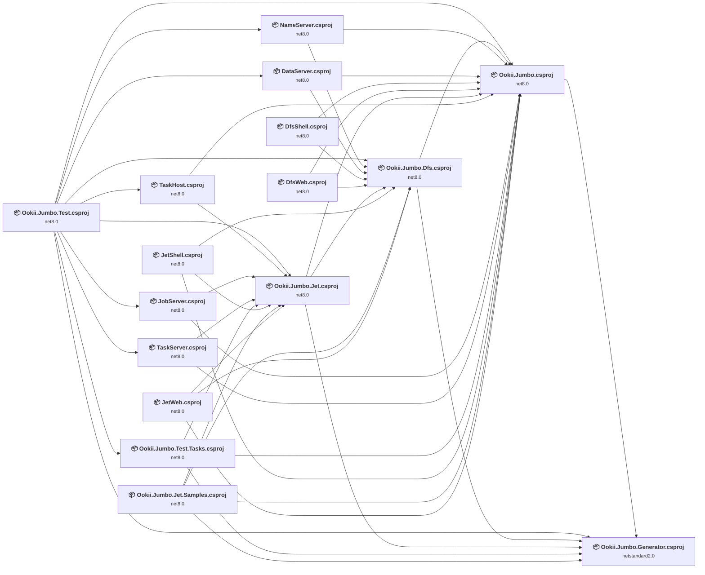

## Project Details

### DataServer\DataServer.csproj

#### Project Info

- **Current Target Framework:** net8.0
- **Proposed Target Framework:** net10.0
- **SDK-style**: True
- **Project Kind:** DotNetCoreApp
- **Dependencies**: 2
- **Dependants**: 1
- **Number of Files**: 5
- **Number of Files with Incidents**: 1
- **Lines of Code**: 776
- **Estimated LOC to modify**: 0+ (at least 0.0% of the project)

#### Dependency Graph

Legend:
📦 SDK-style project
⚙️ Classic project

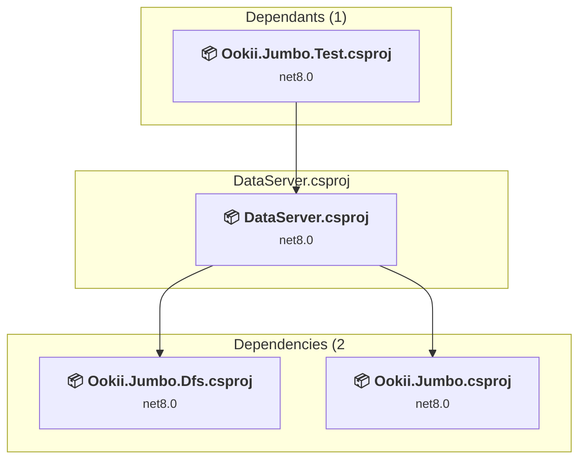

### API Compatibility

| Category | Count | Impact |
| :--- | :---: | :--- |
| 🔴 Binary Incompatible | 0 | High - Require code changes |
| 🟡 Source Incompatible | 0 | Medium - Needs re-compilation and potential conflicting API error fixing |
| 🔵 Behavioral change | 0 | Low - Behavioral changes that may require testing at runtime |
| ✅ Compatible | 749 |  |
| ***Total APIs Analyzed*** | ***749*** |  |

### DfsShell\DfsShell.csproj

#### Project Info

- **Current Target Framework:** net8.0
- **Proposed Target Framework:** net10.0
- **SDK-style**: True
- **Project Kind:** DotNetCoreApp
- **Dependencies**: 2
- **Dependants**: 0
- **Number of Files**: 18
- **Number of Files with Incidents**: 2
- **Lines of Code**: 1021
- **Estimated LOC to modify**: 7+ (at least 0.7% of the project)

#### Dependency Graph

Legend:
📦 SDK-style project
⚙️ Classic project

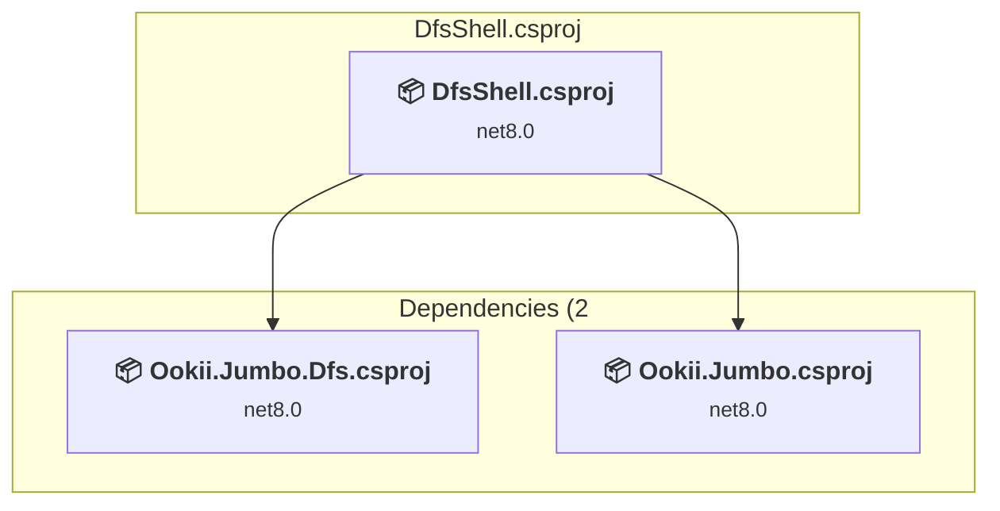

### API Compatibility

| Category | Count | Impact |
| :--- | :---: | :--- |
| 🔴 Binary Incompatible | 0 | High - Require code changes |
| 🟡 Source Incompatible | 7 | Medium - Needs re-compilation and potential conflicting API error fixing |
| 🔵 Behavioral change | 0 | Low - Behavioral changes that may require testing at runtime |
| ✅ Compatible | 936 |  |
| ***Total APIs Analyzed*** | ***943*** |  |

#### Project Technologies and Features

| Technology | Issues | Percentage | Migration Path |
| :--- | :---: | :---: | :--- |
| Legacy Configuration System | 7 | 100.0% | Legacy XML-based configuration system (app.config/web.config) that has been replaced by a more flexible configuration model in .NET Core. The old system was rigid and XML-based. Migrate to Microsoft.Extensions.Configuration with JSON/environment variables; use System.Configuration.ConfigurationManager NuGet package as interim bridge if needed. |

### DfsWeb\DfsWeb.csproj

#### Project Info

- **Current Target Framework:** net8.0
- **Proposed Target Framework:** net10.0
- **SDK-style**: True
- **Project Kind:** AspNetCore
- **Dependencies**: 2
- **Dependants**: 0
- **Number of Files**: 29
- **Number of Files with Incidents**: 2
- **Lines of Code**: 781
- **Estimated LOC to modify**: 2+ (at least 0.3% of the project)

#### Dependency Graph

Legend:
📦 SDK-style project
⚙️ Classic project

### API Compatibility

| Category | Count | Impact |
| :--- | :---: | :--- |
| 🔴 Binary Incompatible | 0 | High - Require code changes |
| 🟡 Source Incompatible | 2 | Medium - Needs re-compilation and potential conflicting API error fixing |
| 🔵 Behavioral change | 0 | Low - Behavioral changes that may require testing at runtime |
| ✅ Compatible | 2358 |  |
| ***Total APIs Analyzed*** | ***2360*** |  |

### JetShell\JetShell.csproj

#### Project Info

- **Current Target Framework:** net8.0
- **Proposed Target Framework:** net10.0
- **SDK-style**: True
- **Project Kind:** DotNetCoreApp
- **Dependencies**: 3
- **Dependants**: 0
- **Number of Files**: 7
- **Number of Files with Incidents**: 2
- **Lines of Code**: 304
- **Estimated LOC to modify**: 7+ (at least 2.3% of the project)

#### Dependency Graph

Legend:
📦 SDK-style project
⚙️ Classic project

### API Compatibility

| Category | Count | Impact |
| :--- | :---: | :--- |
| 🔴 Binary Incompatible | 0 | High - Require code changes |
| 🟡 Source Incompatible | 7 | Medium - Needs re-compilation and potential conflicting API error fixing |
| 🔵 Behavioral change | 0 | Low - Behavioral changes that may require testing at runtime |
| ✅ Compatible | 298 |  |
| ***Total APIs Analyzed*** | ***305*** |  |

#### Project Technologies and Features

| Technology | Issues | Percentage | Migration Path |
| :--- | :---: | :---: | :--- |
| Legacy Configuration System | 7 | 100.0% | Legacy XML-based configuration system (app.config/web.config) that has been replaced by a more flexible configuration model in .NET Core. The old system was rigid and XML-based. Migrate to Microsoft.Extensions.Configuration with JSON/environment variables; use System.Configuration.ConfigurationManager NuGet package as interim bridge if needed. |

### JetWeb\JetWeb.csproj

#### Project Info

- **Current Target Framework:** net8.0
- **Proposed Target Framework:** net10.0
- **SDK-style**: True
- **Project Kind:** AspNetCore
- **Dependencies**: 3
- **Dependants**: 0
- **Number of Files**: 25
- **Number of Files with Incidents**: 2
- **Lines of Code**: 1175
- **Estimated LOC to modify**: 2+ (at least 0.2% of the project)

#### Dependency Graph

Legend:
📦 SDK-style project
⚙️ Classic project

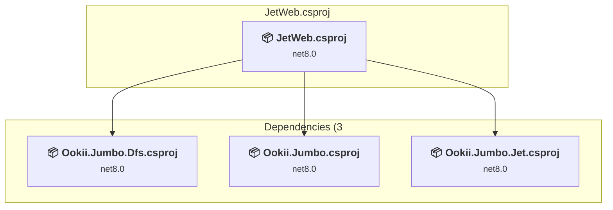

### API Compatibility

| Category | Count | Impact |
| :--- | :---: | :--- |
| 🔴 Binary Incompatible | 0 | High - Require code changes |
| 🟡 Source Incompatible | 2 | Medium - Needs re-compilation and potential conflicting API error fixing |
| 🔵 Behavioral change | 0 | Low - Behavioral changes that may require testing at runtime |
| ✅ Compatible | 4561 |  |
| ***Total APIs Analyzed*** | ***4563*** |  |

### JobServer\JobServer.csproj

#### Project Info

- **Current Target Framework:** net8.0
- **Proposed Target Framework:** net10.0
- **SDK-style**: True
- **Project Kind:** DotNetCoreApp
- **Dependencies**: 2
- **Dependants**: 1
- **Number of Files**: 12
- **Number of Files with Incidents**: 1
- **Lines of Code**: 2464
- **Estimated LOC to modify**: 0+ (at least 0.0% of the project)

#### Dependency Graph

Legend:
📦 SDK-style project
⚙️ Classic project

### API Compatibility

| Category | Count | Impact |
| :--- | :---: | :--- |
| 🔴 Binary Incompatible | 0 | High - Require code changes |
| 🟡 Source Incompatible | 0 | Medium - Needs re-compilation and potential conflicting API error fixing |
| 🔵 Behavioral change | 0 | Low - Behavioral changes that may require testing at runtime |
| ✅ Compatible | 2107 |  |
| ***Total APIs Analyzed*** | ***2107*** |  |

### NameServer\NameServer.csproj

#### Project Info

- **Current Target Framework:** net8.0
- **Proposed Target Framework:** net10.0
- **SDK-style**: True
- **Project Kind:** DotNetCoreApp
- **Dependencies**: 2
- **Dependants**: 1
- **Number of Files**: 16
- **Number of Files with Incidents**: 4
- **Lines of Code**: 3609
- **Estimated LOC to modify**: 7+ (at least 0.2% of the project)

#### Dependency Graph

Legend:
📦 SDK-style project
⚙️ Classic project

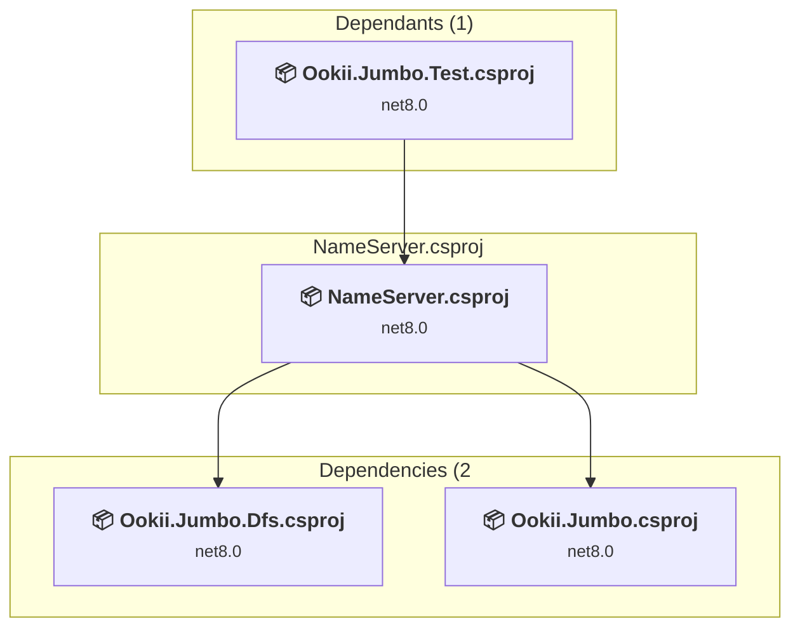

### API Compatibility

| Category | Count | Impact |
| :--- | :---: | :--- |
| 🔴 Binary Incompatible | 0 | High - Require code changes |
| 🟡 Source Incompatible | 0 | Medium - Needs re-compilation and potential conflicting API error fixing |
| 🔵 Behavioral change | 7 | Low - Behavioral changes that may require testing at runtime |
| ✅ Compatible | 2800 |  |
| ***Total APIs Analyzed*** | ***2807*** |  |

### Ookii.Jumbo.Dfs\Ookii.Jumbo.Dfs.csproj

#### Project Info

- **Current Target Framework:** net8.0
- **Proposed Target Framework:** net10.0
- **SDK-style**: True
- **Project Kind:** ClassLibrary
- **Dependencies**: 2
- **Dependants**: 9
- **Number of Files**: 47
- **Number of Files with Incidents**: 10
- **Lines of Code**: 4927
- **Estimated LOC to modify**: 114+ (at least 2.3% of the project)

#### Dependency Graph

Legend:
📦 SDK-style project
⚙️ Classic project

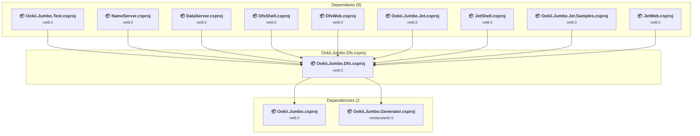

### API Compatibility

| Category | Count | Impact |
| :--- | :---: | :--- |
| 🔴 Binary Incompatible | 0 | High - Require code changes |
| 🟡 Source Incompatible | 83 | Medium - Needs re-compilation and potential conflicting API error fixing |
| 🔵 Behavioral change | 31 | Low - Behavioral changes that may require testing at runtime |
| ✅ Compatible | 3401 |  |
| ***Total APIs Analyzed*** | ***3515*** |  |

#### Project Technologies and Features

| Technology | Issues | Percentage | Migration Path |
| :--- | :---: | :---: | :--- |
| Legacy Configuration System | 83 | 72.8% | Legacy XML-based configuration system (app.config/web.config) that has been replaced by a more flexible configuration model in .NET Core. The old system was rigid and XML-based. Migrate to Microsoft.Extensions.Configuration with JSON/environment variables; use System.Configuration.ConfigurationManager NuGet package as interim bridge if needed. |

### Ookii.Jumbo.Generator\Ookii.Jumbo.Generator.csproj

#### Project Info

- **Current Target Framework:** netstandard2.0✅
- **SDK-style**: True
- **Project Kind:** ClassLibrary
- **Dependencies**: 0
- **Dependants**: 6
- **Number of Files**: 7
- **Lines of Code**: 1117
- **Estimated LOC to modify**: 0+ (at least 0.0% of the project)

#### Dependency Graph

Legend:
📦 SDK-style project
⚙️ Classic project

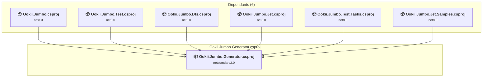

### API Compatibility

| Category | Count | Impact |
| :--- | :---: | :--- |
| 🔴 Binary Incompatible | 0 | High - Require code changes |
| 🟡 Source Incompatible | 0 | Medium - Needs re-compilation and potential conflicting API error fixing |
| 🔵 Behavioral change | 0 | Low - Behavioral changes that may require testing at runtime |
| ✅ Compatible | 1196 |  |
| ***Total APIs Analyzed*** | ***1196*** |  |

### Ookii.Jumbo.Jet.Samples\Ookii.Jumbo.Jet.Samples.csproj

#### Project Info

- **Current Target Framework:** net8.0
- **Proposed Target Framework:** net10.0
- **SDK-style**: True
- **Project Kind:** ClassLibrary
- **Dependencies**: 4
- **Dependants**: 0
- **Number of Files**: 34
- **Number of Files with Incidents**: 1
- **Lines of Code**: 4345
- **Estimated LOC to modify**: 0+ (at least 0.0% of the project)

#### Dependency Graph

Legend:
📦 SDK-style project
⚙️ Classic project

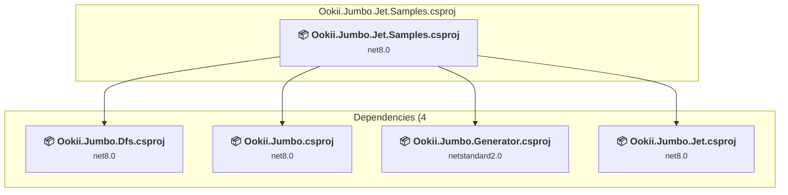

### API Compatibility

| Category | Count | Impact |
| :--- | :---: | :--- |
| 🔴 Binary Incompatible | 0 | High - Require code changes |
| 🟡 Source Incompatible | 0 | Medium - Needs re-compilation and potential conflicting API error fixing |
| 🔵 Behavioral change | 0 | Low - Behavioral changes that may require testing at runtime |
| ✅ Compatible | 2519 |  |
| ***Total APIs Analyzed*** | ***2519*** |  |

### Ookii.Jumbo.Jet\Ookii.Jumbo.Jet.csproj

#### Project Info

- **Current Target Framework:** net8.0
- **Proposed Target Framework:** net10.0
- **SDK-style**: True
- **Project Kind:** ClassLibrary
- **Dependencies**: 3
- **Dependants**: 8
- **Number of Files**: 162
- **Number of Files with Incidents**: 15
- **Lines of Code**: 21768
- **Estimated LOC to modify**: 242+ (at least 1.1% of the project)

#### Dependency Graph

Legend:
📦 SDK-style project
⚙️ Classic project

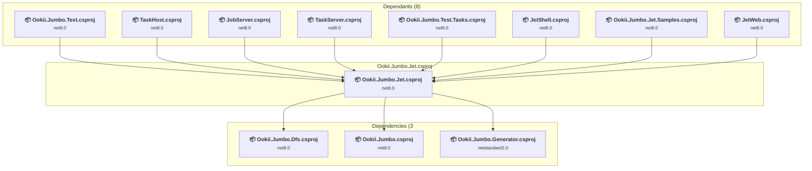

### API Compatibility

| Category | Count | Impact |
| :--- | :---: | :--- |
| 🔴 Binary Incompatible | 0 | High - Require code changes |
| 🟡 Source Incompatible | 233 | Medium - Needs re-compilation and potential conflicting API error fixing |
| 🔵 Behavioral change | 9 | Low - Behavioral changes that may require testing at runtime |
| ✅ Compatible | 13573 |  |
| ***Total APIs Analyzed*** | ***13815*** |  |

#### Project Technologies and Features

| Technology | Issues | Percentage | Migration Path |
| :--- | :---: | :---: | :--- |
| Legacy Configuration System | 233 | 96.3% | Legacy XML-based configuration system (app.config/web.config) that has been replaced by a more flexible configuration model in .NET Core. The old system was rigid and XML-based. Migrate to Microsoft.Extensions.Configuration with JSON/environment variables; use System.Configuration.ConfigurationManager NuGet package as interim bridge if needed. |

### Ookii.Jumbo.Test.Tasks\Ookii.Jumbo.Test.Tasks.csproj

#### Project Info

- **Current Target Framework:** net8.0
- **Proposed Target Framework:** net10.0
- **SDK-style**: True
- **Project Kind:** ClassLibrary
- **Dependencies**: 3
- **Dependants**: 1
- **Number of Files**: 18
- **Number of Files with Incidents**: 1
- **Lines of Code**: 680
- **Estimated LOC to modify**: 0+ (at least 0.0% of the project)

#### Dependency Graph

Legend:
📦 SDK-style project
⚙️ Classic project

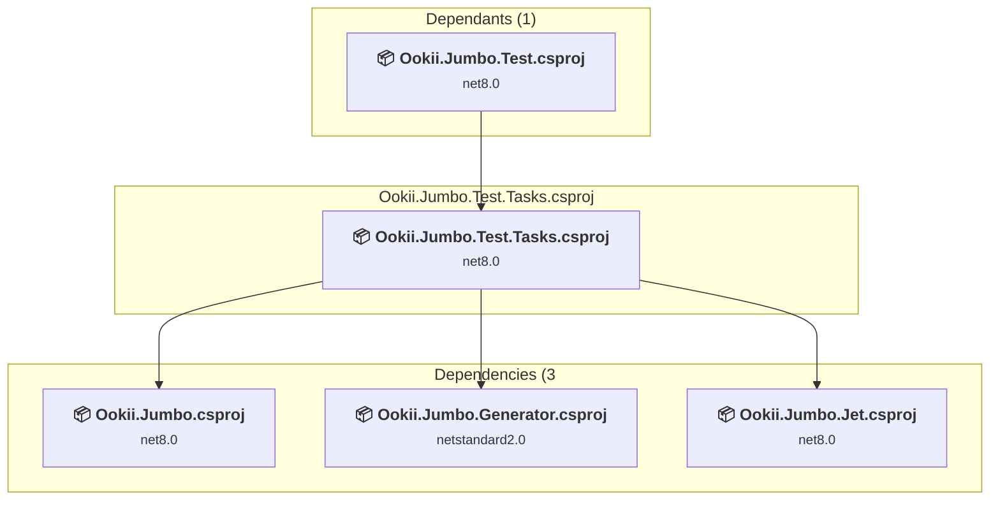

### API Compatibility

| Category | Count | Impact |
| :--- | :---: | :--- |
| 🔴 Binary Incompatible | 0 | High - Require code changes |
| 🟡 Source Incompatible | 0 | Medium - Needs re-compilation and potential conflicting API error fixing |
| 🔵 Behavioral change | 0 | Low - Behavioral changes that may require testing at runtime |
| ✅ Compatible | 439 |  |
| ***Total APIs Analyzed*** | ***439*** |  |

### Ookii.Jumbo.Test\Ookii.Jumbo.Test.csproj

#### Project Info

- **Current Target Framework:** net8.0
- **Proposed Target Framework:** net10.0
- **SDK-style**: True
- **Project Kind:** DotNetCoreApp
- **Dependencies**: 10
- **Dependants**: 0
- **Number of Files**: 52
- **Number of Files with Incidents**: 4
- **Lines of Code**: 7867
- **Estimated LOC to modify**: 17+ (at least 0.2% of the project)

#### Dependency Graph

Legend:
📦 SDK-style project
⚙️ Classic project

```mermaid
flowchart TB
    subgraph current["Ookii.Jumbo.Test.csproj"]
        MAIN["<b>📦&nbsp;Ookii.Jumbo.Test.csproj</b><br/><small>net8.0</small>"]
        click MAIN "#ookiijumbotestookiijumbotestcsproj"
    end
    subgraph downstream["Dependencies (10"]
        P3["<b>📦&nbsp;Ookii.Jumbo.Dfs.csproj</b><br/><small>net8.0</small>"]
        P9["<b>📦&nbsp;TaskHost.csproj</b><br/><small>net8.0</small>"]
        P1["<b>📦&nbsp;Ookii.Jumbo.csproj</b><br/><small>net8.0</small>"]
        P10["<b>📦&nbsp;JobServer.csproj</b><br/><small>net8.0</small>"]
        P16["<b>📦&nbsp;Ookii.Jumbo.Generator.csproj</b><br/><small>netstandard2.0</small>"]
        P4["<b>📦&nbsp;NameServer.csproj</b><br/><small>net8.0</small>"]
        P11["<b>📦&nbsp;TaskServer.csproj</b><br/><small>net8.0</small>"]
        P8["<b>📦&nbsp;Ookii.Jumbo.Jet.csproj</b><br/><small>net8.0</small>"]
        P12["<b>📦&nbsp;Ookii.Jumbo.Test.Tasks.csproj</b><br/><small>net8.0</small>"]
        P5["<b>📦&nbsp;DataServer.csproj</b><br/><small>net8.0</small>"]
        click P3 "#ookiijumbodfsookiijumbodfscsproj"
        click P9 "#taskhosttaskhostcsproj"
        click P1 "#ookiijumboookiijumbocsproj"
        click P10 "#jobserverjobservercsproj"
        click P16 "#ookiijumbogeneratorookiijumbogeneratorcsproj"
        click P4 "#nameservernameservercsproj"
        click P11 "#taskservertaskservercsproj"
        click P8 "#ookiijumbojetookiijumbojetcsproj"
        click P12 "#ookiijumbotesttasksookiijumbotesttaskscsproj"
        click P5 "#dataserverdataservercsproj"
    end
    MAIN --> P3
    MAIN --> P9
    MAIN --> P1
    MAIN --> P10
    MAIN --> P16
    MAIN --> P4
    MAIN --> P11
    MAIN --> P8
    MAIN --> P12
    MAIN --> P5

```

### API Compatibility

| Category | Count | Impact |
| :--- | :---: | :--- |
| 🔴 Binary Incompatible | 0 | High - Require code changes |
| 🟡 Source Incompatible | 0 | Medium - Needs re-compilation and potential conflicting API error fixing |
| 🔵 Behavioral change | 17 | Low - Behavioral changes that may require testing at runtime |
| ✅ Compatible | 12577 |  |
| ***Total APIs Analyzed*** | ***12594*** |  |

### Ookii.Jumbo\Ookii.Jumbo.csproj

#### Project Info

- **Current Target Framework:** net8.0
- **Proposed Target Framework:** net10.0
- **SDK-style**: True
- **Project Kind:** ClassLibrary
- **Dependencies**: 1
- **Dependants**: 14
- **Number of Files**: 121
- **Number of Files with Incidents**: 15
- **Lines of Code**: 15876
- **Estimated LOC to modify**: 113+ (at least 0.7% of the project)

#### Dependency Graph

Legend:
📦 SDK-style project
⚙️ Classic project

```mermaid
flowchart TB
    subgraph upstream["Dependants (14)"]
        P2["<b>📦&nbsp;Ookii.Jumbo.Test.csproj</b><br/><small>net8.0</small>"]
        P3["<b>📦&nbsp;Ookii.Jumbo.Dfs.csproj</b><br/><small>net8.0</small>"]
        P4["<b>📦&nbsp;NameServer.csproj</b><br/><small>net8.0</small>"]
        P5["<b>📦&nbsp;DataServer.csproj</b><br/><small>net8.0</small>"]
        P6["<b>📦&nbsp;DfsShell.csproj</b><br/><small>net8.0</small>"]
        P7["<b>📦&nbsp;DfsWeb.csproj</b><br/><small>net8.0</small>"]
        P8["<b>📦&nbsp;Ookii.Jumbo.Jet.csproj</b><br/><small>net8.0</small>"]
        P9["<b>📦&nbsp;TaskHost.csproj</b><br/><small>net8.0</small>"]
        P10["<b>📦&nbsp;JobServer.csproj</b><br/><small>net8.0</small>"]
        P11["<b>📦&nbsp;TaskServer.csproj</b><br/><small>net8.0</small>"]
        P12["<b>📦&nbsp;Ookii.Jumbo.Test.Tasks.csproj</b><br/><small>net8.0</small>"]
        P13["<b>📦&nbsp;JetShell.csproj</b><br/><small>net8.0</small>"]
        P14["<b>📦&nbsp;Ookii.Jumbo.Jet.Samples.csproj</b><br/><small>net8.0</small>"]
        P15["<b>📦&nbsp;JetWeb.csproj</b><br/><small>net8.0</small>"]
        click P2 "#ookiijumbotestookiijumbotestcsproj"
        click P3 "#ookiijumbodfsookiijumbodfscsproj"
        click P4 "#nameservernameservercsproj"
        click P5 "#dataserverdataservercsproj"
        click P6 "#dfsshelldfsshellcsproj"
        click P7 "#dfswebdfswebcsproj"
        click P8 "#ookiijumbojetookiijumbojetcsproj"
        click P9 "#taskhosttaskhostcsproj"
        click P10 "#jobserverjobservercsproj"
        click P11 "#taskservertaskservercsproj"
        click P12 "#ookiijumbotesttasksookiijumbotesttaskscsproj"
        click P13 "#jetshelljetshellcsproj"
        click P14 "#ookiijumbojetsamplesookiijumbojetsamplescsproj"
        click P15 "#jetwebjetwebcsproj"
    end
    subgraph current["Ookii.Jumbo.csproj"]
        MAIN["<b>📦&nbsp;Ookii.Jumbo.csproj</b><br/><small>net8.0</small>"]
        click MAIN "#ookiijumboookiijumbocsproj"
    end
    subgraph downstream["Dependencies (1"]
        P16["<b>📦&nbsp;Ookii.Jumbo.Generator.csproj</b><br/><small>netstandard2.0</small>"]
        click P16 "#ookiijumbogeneratorookiijumbogeneratorcsproj"
    end
    P2 --> MAIN
    P3 --> MAIN
    P4 --> MAIN
    P5 --> MAIN
    P6 --> MAIN
    P7 --> MAIN
    P8 --> MAIN
    P9 --> MAIN
    P10 --> MAIN
    P11 --> MAIN
    P12 --> MAIN
    P13 --> MAIN
    P14 --> MAIN
    P15 --> MAIN
    MAIN --> P16

```

### API Compatibility

| Category | Count | Impact |
| :--- | :---: | :--- |
| 🔴 Binary Incompatible | 0 | High - Require code changes |
| 🟡 Source Incompatible | 99 | Medium - Needs re-compilation and potential conflicting API error fixing |
| 🔵 Behavioral change | 14 | Low - Behavioral changes that may require testing at runtime |
| ✅ Compatible | 7572 |  |
| ***Total APIs Analyzed*** | ***7685*** |  |

#### Project Technologies and Features

| Technology | Issues | Percentage | Migration Path |
| :--- | :---: | :---: | :--- |
| System Management (WMI) | 34 | 30.1% | Windows Management Instrumentation (WMI) APIs for system administration and monitoring that are available via NuGet package System.Management. These APIs provide access to Windows system information but are Windows-only; consider cross-platform alternatives for new code. |
| Legacy Configuration System | 65 | 57.5% | Legacy XML-based configuration system (app.config/web.config) that has been replaced by a more flexible configuration model in .NET Core. The old system was rigid and XML-based. Migrate to Microsoft.Extensions.Configuration with JSON/environment variables; use System.Configuration.ConfigurationManager NuGet package as interim bridge if needed. |

### TaskHost\TaskHost.csproj

#### Project Info

- **Current Target Framework:** net8.0
- **Proposed Target Framework:** net10.0
- **SDK-style**: True
- **Project Kind:** DotNetCoreApp
- **Dependencies**: 2
- **Dependants**: 1
- **Number of Files**: 1
- **Number of Files with Incidents**: 1
- **Lines of Code**: 41
- **Estimated LOC to modify**: 0+ (at least 0.0% of the project)

#### Dependency Graph

Legend:
📦 SDK-style project
⚙️ Classic project

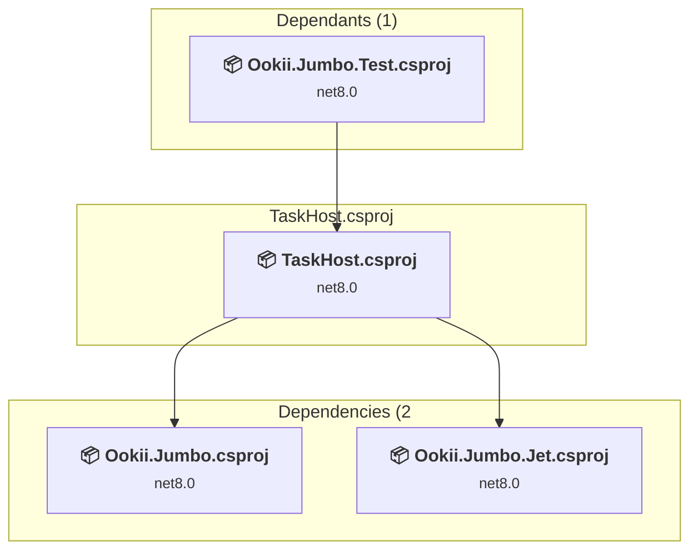

### API Compatibility

| Category | Count | Impact |
| :--- | :---: | :--- |
| 🔴 Binary Incompatible | 0 | High - Require code changes |
| 🟡 Source Incompatible | 0 | Medium - Needs re-compilation and potential conflicting API error fixing |
| 🔵 Behavioral change | 0 | Low - Behavioral changes that may require testing at runtime |
| ✅ Compatible | 31 |  |
| ***Total APIs Analyzed*** | ***31*** |  |

### TaskServer\TaskServer.csproj

#### Project Info

- **Current Target Framework:** net8.0
- **Proposed Target Framework:** net10.0
- **SDK-style**: True
- **Project Kind:** DotNetCoreApp
- **Dependencies**: 2
- **Dependants**: 1
- **Number of Files**: 7
- **Number of Files with Incidents**: 3
- **Lines of Code**: 1231
- **Estimated LOC to modify**: 29+ (at least 2.4% of the project)

#### Dependency Graph

Legend:
📦 SDK-style project
⚙️ Classic project

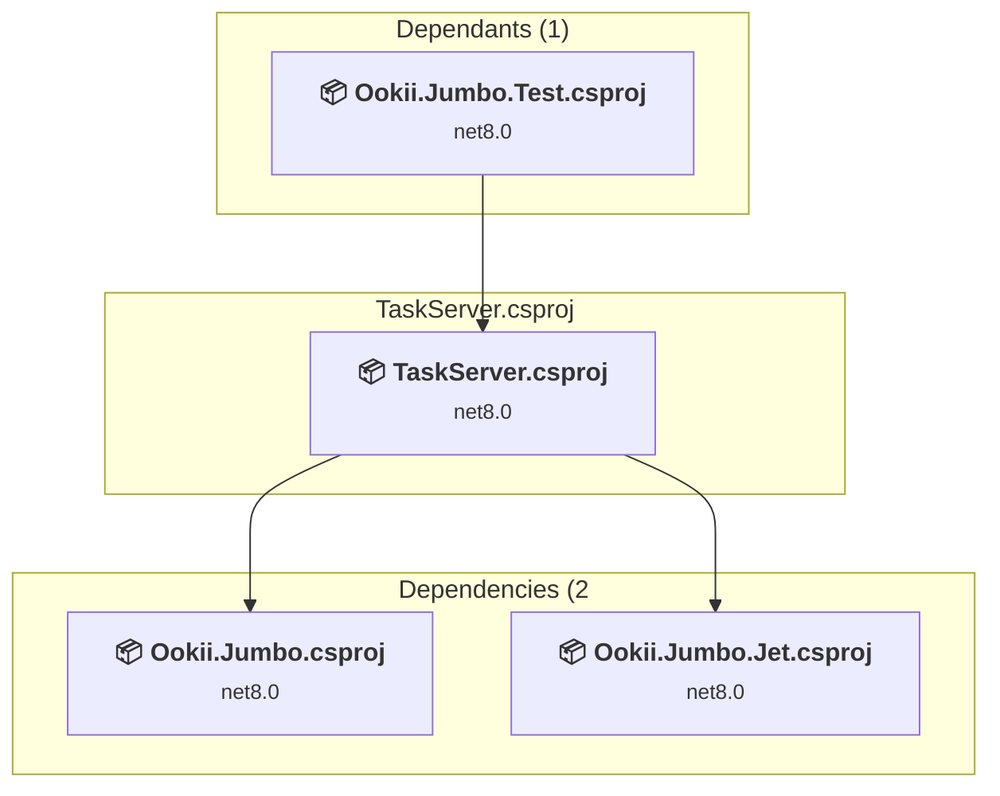

### API Compatibility

| Category | Count | Impact |
| :--- | :---: | :--- |
| 🔴 Binary Incompatible | 0 | High - Require code changes |
| 🟡 Source Incompatible | 28 | Medium - Needs re-compilation and potential conflicting API error fixing |
| 🔵 Behavioral change | 1 | Low - Behavioral changes that may require testing at runtime |
| ✅ Compatible | 1288 |  |
| ***Total APIs Analyzed*** | ***1317*** |  |

#### Project Technologies and Features

| Technology | Issues | Percentage | Migration Path |
| :--- | :---: | :---: | :--- |
| Legacy Configuration System | 28 | 96.6% | Legacy XML-based configuration system (app.config/web.config) that has been replaced by a more flexible configuration model in .NET Core. The old system was rigid and XML-based. Migrate to Microsoft.Extensions.Configuration with JSON/environment variables; use System.Configuration.ConfigurationManager NuGet package as interim bridge if needed. |

