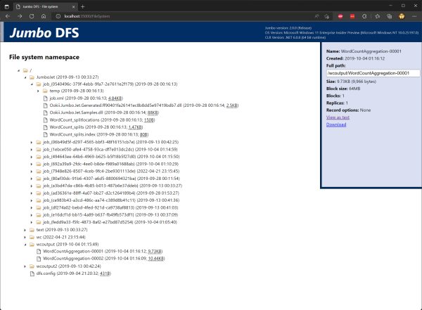

# Jumbo DFS features

Here, we'll look at some of the features of the Jumbo DFS.

## NameServer edit log

The NameServer stores the entire file system namespace in memory. When the namespace is mutated
(file/directory created/deleted/moved, a block appended, etc.) the NameServer writes an entry to
its edit log describing the operation, before comitting the change to the in-memory namespace.

When the NameServer starts, it replays all the entries in the log to recreate the namespace from when
the NameServer was last stopped.

Because the log file can get quite large, this increases the startup time for the NameServer. To
avoid this, the NameServer periodically saves a snapshot of the namespace, and starts a new edit log
file that only contains mutations after the current snapshot. When starting, the NameServer can now
load the snapshot before replaying the log.

## DFS safe mode

When the NameServer starts, it starts in something called "safe mode." While in this mode,
it will not try to create new replicas for underreplicated blocks. This prevents additional replicas
from being created while the NameServer is waiting for all the DataServers to start and report in.

Once the number of data servers has reached the default replication factor (usually three), and there
are no more underreplicated blocks, safe mode is turned off. Beyond this point, if a data server
crashes or is removed from the cluster, any underreplicated blocks will be re-replicated to a
different node.

You can also manually toggle safe mode via DfsShell and DfsWeb. By turning it off manually, you
can force re-replication of blocks if a DataServer is not starting.

## Per-file block size and replication factor

While the DFS configuration specifies a default block size and replication factor, DfsShell and
other clients (such as Jumbo Jet jobs) can override these parameters on a per-file basis. However,
all blocks in a file must be the same size (except for the final block) and have the same
replication factor.

## Record-aware streams

Jumbo tries to exploit data locality whenever possible, and the main way it does that is by
scheduling tasks on nodes that have their input data. This is done by looking at the block that
contains the task's input split.

However, records can cross the boundary between blocks, meaning that at the end of the task's
input split, the task must continue reading into the next block to find the end of the current
record. That next block is likely not data local. Even though the amount of data read is usually
small, that's still a connection that must be made to a different DataServer which must read that
data from disk. In addition, a small amount at the start of the block may be read which is not used
while looking for the start of a record.

To avoid this, Jumbo DFS can indicate that a file is record-aware, which is done by specifying
[`RecordStreamOptions.DoNotCrossBoundary`][] when the file is created. The [`DfsOutputStream`][]
that is used to write files implements [`IRecordOutputStream`][], which lets a
[`StreamRecordWriter<T>`][] indicate where records start. In this case, [`DfsOutputStream`][] makes
sure that records never cross a block boundary, switching to the next block if a record doesn't fit
in the current block.

In this case, all blocks in a file will have slightly different sizes, up to the file's specified
block size.

When record-aware streams are used, the [`StreamRecordReader<T>`][] uses [`IRecordInputStream`][] to
determine that it doesn't need to continue reading past a block boundary, preventing any non-local
data from being read.

## DfsShell

DfsShell is a command line tool for interacting with the DFS. It's the primary way you'll upload,
download, view and manipulate files and directories. We already used it to upload input data and
view the results of our first job in the [quick start guide](../QuickStart.md).

Additionally, DfsShell also lets you view DFS metrics (size, capacity, server status), and check
the state of safe mode.

Here is a full list of DfsShell commands:

```text
Usage: DfsShell <command> [args...]

The following commands are available:

    blockinfo
        Prints the data server list for the specified block.

    blocks
        Prints a list of blocks.

    cat
        Prints a text file.

    fileinfo
        Prints information about the specified file.

    get
        Retrieves a file or directory from the DFS.

    ls
        Displays the contents of the specified DFS directory.

    metrics
        Prints general information about the DFS.

    mkdir
        Creates a new directory on the DFS.

    mv
        Moves a file or directory on the DFS.

    put
        Stores a file or directory on the DFS.

    rm
        Deletes a file or directory from the DFS.

    safemode
        Checks whether safemode is on or off.

    version
        Shows version information.

    waitsafemode
        Waits until the name server leaves safe mode.
```

## DfsWeb

Jumbo includes an administration portal for the DFS which lets you view its status in your web
browser. By default, it's available on port 35000 of the NameServer node, though this can be
customized.

DfsWeb lets you see an overview of the file system's status, including the size, capacity, and number
of blocks. It also shows a list of the DataServers and their health, and provides convenient access
to the diagnostic log files of the NameServer and DataServers.

Here's what that looks like with a single-node setup (unfortunately, I don't have any screenshots
of running Jumbo on a larger cluster).

[](images/DfsWeb.png)

DfsWeb also allows you to browse the file system namespace, and view and download files. Uploading
files is not supported; for that, you have to use DfsShell.

[](images/DfsWebBrowse.png)

Next, we'll look at [Jumbo Jet's features](JetFeatures.md).

[`DfsOutputStream`]: https://www.ookii.org/docs/jumbo-2.0/html/T_Ookii_Jumbo_Dfs_DfsOutputStream.htm
[`IRecordInputStream`]: https://www.ookii.org/docs/jumbo-2.0/html/T_Ookii_Jumbo_IO_IRecordInputStream.htm
[`IRecordOutputStream`]: https://www.ookii.org/docs/jumbo-2.0/html/T_Ookii_Jumbo_IO_IRecordOutputStream.htm
[`RecordStreamOptions.DoNotCrossBoundary`]: https://www.ookii.org/docs/jumbo-2.0/html/T_Ookii_Jumbo_IO_RecordStreamOptions.htm
[`StreamRecordReader<T>`]: https://www.ookii.org/docs/jumbo-2.0/html/T_Ookii_Jumbo_IO_StreamRecordReader_1.htm
[`StreamRecordWriter<T>`]: https://www.ookii.org/docs/jumbo-2.0/html/T_Ookii_Jumbo_IO_StreamRecordWriter_1.htm
