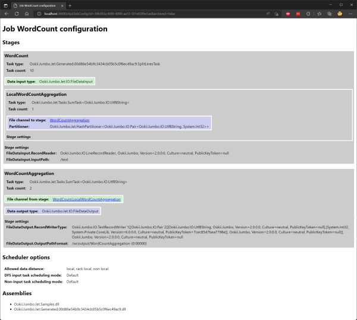
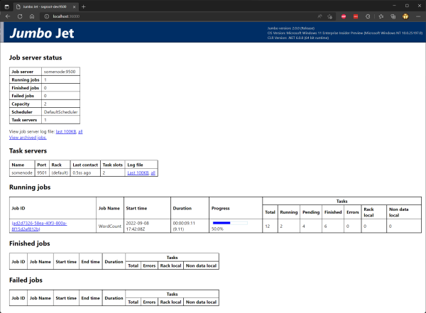
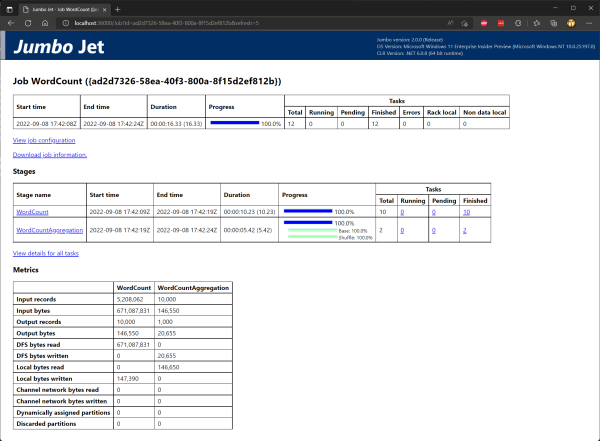
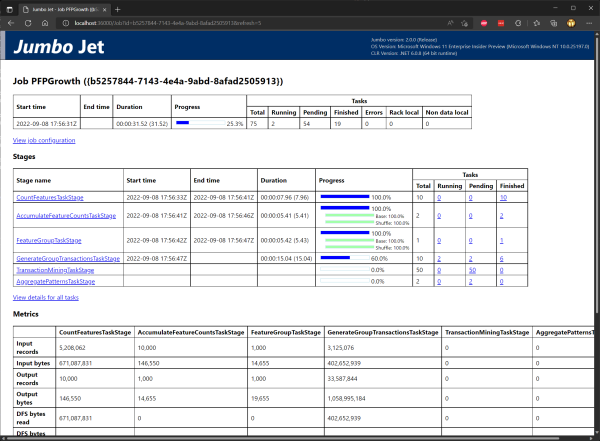

# Jumbo Jet features

This section provides more detail about the major features of Jumbo Jet.

## Job Configuration

The configuration for a job is specified as an XML file, which indicates for every stage what its
inputs and outputs are, what its task type is, and other options such as the partitioner or
multi-input record reader for each channel. You can also add settings to the configuration which
can be accessed by your tasks.

When you work with the [`JobBuilder`](https://www.ookii.org/docs/jumbo-2.0/html/T_Ookii_Jumbo_Jet_Jobs_Builder_JobBuilder.htm),
it constructs a sequence of operations from the methods you call which is then translated into a
configuration. It is possible to manually configure a job using the [`JobConfiguration`](https://www.ookii.org/docs/jumbo-2.0/html/T_Ookii_Jumbo_Jet_Jobs_JobConfiguration.htm)
class, or if you really want you could manually write the XML file.

However, usually using the `JobBuilder` is the best option. If you’re using a job runner derived
from [`JobBuilderJob`](https://www.ookii.org/docs/jumbo-2.0/html/T_Ookii_Jumbo_Jet_Jobs_Builder_JobBuilderJob.htm),
you can override the [`OnJobCreated`](https://www.ookii.org/docs/jumbo-2.0/html/M_Ookii_Jumbo_Jet_Jobs_Builder_JobBuilderJob_OnJobCreated.htm)
method to customize elements of the configuration after it has been created.

You can also easily add job settings based on the properties of your job runner, by applying the
[`JobSettingAttribute`](https://www.ookii.org/docs/jumbo-2.0/html/T_Ookii_Jumbo_Jet_Jobs_JobSettingAttribute.htm)
attribute to the property. This works by calling the [`ApplyJobPropertiesAndSettings`](https://www.ookii.org/docs/jumbo-2.0/html/M_Ookii_Jumbo_Jet_Jobs_BaseJobRunner_ApplyJobPropertiesAndSettings.htm)
method, which `JobBuilderJob` does automatically. This method also allows the user to override any
job property or setting using the `-Property` and `-Setting` command line arguments defined by the
[`BaseJobRunner`](https://www.ookii.org/docs/jumbo-2.0/html/T_Ookii_Jumbo_Jet_Jobs_BaseJobRunner.htm).

Job and stage settings can be accessed by your tasks through the [`TaskContext`](https://www.ookii.org/docs/jumbo-2.0/html/T_Ookii_Jumbo_Jet_TaskContext.htm)
class. You can get an instance of this class by using the `JobBuilder` overloads that take a delegate
with a `TaskContext` parameter, or if you're writing your own task type, by implementing [`IConfigurable`](https://www.ookii.org/docs/jumbo-2.0/html/T_Ookii_Jumbo_Jet_IConfigurable.htm)
or (for convenience) deriving from [`Configurable`](https://www.ookii.org/docs/jumbo-2.0/html/T_Ookii_Jumbo_Jet_Configurable.htm).

You can view the XML job configuration for a job using the JetWeb website. They come with a style
sheet for easy viewing, but you can also view the raw XML of course.

Here's what the job configuration for the sample WordCount job looks like in JetWeb.

[](images/JetWebJobConfig.png)

[View raw XML.](SampleJobConfiguration.xml)

There is also [documentation for the XML format used](https://www.ookii.org/Link/JumboDocJobConfig).

## Stages

A stage defines a data processing operation to run over a certain set of input data. Stages are
divided into two categories, depending on where their input data comes from:

- **Input stages:** also called DFS input stages, these read data from one or more DFS files.
- **Non-input stages:** stages that receive data from another stage through a channel, or don't
  have any input data at all (for example, a stage that just generates data). Non-input stages
  that read from a channel are also called channel input stages.

Yeah, this terminology isn't great. I'd name it differently if I did this nowadays, for sure.

For example, in a MapReduce job there are two stages: map, and reduce. Map is (typically) an input
stage (it reads from the DFS), while reduce is a non-input stage (it receives data from the map
stage).

The job scheduler treats these two types separately. For input stages, it tries to use data locality
to schedule tasks in a stage. For non-input stages (including channel input), there is no such
constraint.

Each stage is divided into one or more tasks, which each process a portion of the stage's input data.

For tasks in input stages, this portion is called a _split_, and is a (part of a) block in the input
file.

For channel input stages, tasks process one partition of the data produced by the stage that generates
their input. How data is partitioned is determined by the channel connecting the stages.

## Tasks

A task executes a data processing operation over a portion of the stage’s input data. They are the
scheduling unit used by Jumbo Jet's job scheduler.

The actual data processing code that a task runs is specified in the job configuration for that
stage, which contains the assembly-qualified name of a class that must implement the
[`ITask<TInput, TOutput>`](https://www.ookii.org/docs/jumbo-2.0/html/T_Ookii_Jumbo_Jet_ITask_2.htm)
generic interface.

When the task is executed, the [`Run`](https://www.ookii.org/docs/jumbo-2.0/html/M_Ookii_Jumbo_Jet_ITask_2_Run.htm)
method of that interface is called with a [`RecordReader`](https://www.ookii.org/docs/jumbo-2.0/html/T_Ookii_Jumbo_IO_RecordReader_1.htm)
that it can use to read input data, and a [`RecordWriter`](https://www.ookii.org/docs/jumbo-2.0/html/T_Ookii_Jumbo_IO_RecordWriter_1.htm)
to write records to the output. It doesn't matter if a task reads from or writes to the DFS or a
channel, it always gets a record reader and a writer, so the task's code is the same. The input
reader automatically limits the records it will read to the task's input split or partition, so a
task doesn't need to be aware of that either.

A task class can implement `IConfigurable` (or inherit from `Configurable` to use a default
implementation) to access various aspects of the job and task configuration during execution.

### Push tasks

The `ITask<TInput, TOutput>` interface provides a pull model, where tasks must read from the input
`RecordReader` and loop until all records have been processed. Jumbo also supports using a push
model, which you can use by inheriting from the [`PushTask<TInput, TOutput>`](https://www.ookii.org/docs/jumbo-2.0/html/T_Ookii_Jumbo_Jet_PushTask_2.htm)
base class.

This class requires you to implement the [`ProcessRecord`](https://www.ookii.org/docs/jumbo-2.0/html/M_Ookii_Jumbo_Jet_PushTask_2_ProcessRecord.htm)
method, which is called for each record in the input. It provides a default implementation of the
`ITask<TInput, TOutput>.Run` method that iterates over the input records and calls `ProcessRecord`
for each one.

Push tasks are treated specially if a stage is the receiving stage of a pipeline channel (see below).
In this case, Jumbo will directly call the `ProcessRecord` method, and will not call the `Run`
method at all. This provides better performance for pipeline channels. For this reason, it's
preferable to derive from `PushTask<TInput, TOutput>` whenever possible.

### Utility task types

Jumbo also provides several utility task types in the [`Ookii.Jumbo.Jet.Tasks`](https://www.ookii.org/docs/jumbo-2.0/html/N_Ookii_Jumbo_Jet_Tasks.htm)
namespace. These include base classes for tasks that perform aggregation, reduce tasks, or tasks
that have no input, among others. These are not treated specially, and are only provided to make
implementing certain types of tasks easier.

### The JobBuilder

The `JobBuilder`, as we've seen in the [tutorial](Tutorial1.md), provides a way to create jobs
without having to manually write task classes or implement `ITask<TInput, TOutput>` directly.
Instead, you only need to write `public static` methods that define the operation and call a
`JobBuilder` method for the type of operation you want to perform passing a delegate to your
data processing method.

`JobBuilder` provides functions to help you build map tasks, reduce tasks, aggregation tasks,
generator tasks, and provides functionality for sorting and joining data.

When using the `JobBuilder` methods that take a delegate, the `JobBuilder` dynamically generates a
class, inheriting from one of the utility task types, that calls the target method of the delegate.

The target method must be `public static` so that it can be called without needing the delegate
inside the task. With the removal of Jumbo's reliance on `BinaryFormatter`, serializing delegates
is no longer supported.

## Channels

Channels determine how data is transferred between the tasks of different stages. Channels are
responsible for transferring the data, for partitioning output data, and merging input data.

The stage that writes to a channel is called the _sending stage_, and the stage that reads from it
the _receiving stage_.

Jumbo has three types of channel: file, TCP, and pipeline:

- **File channels** store intermediate data in a file on the local disk of the node executing a task
of the sending stage, and the tasks in the receiving stage shuffle these files across the network.
This behavior is similar to how the shuffle stage is Hadoop 1.0 works, and offers the best fault
tolerance. File channels should be used in most cases.
- **TCP channels** make a direct network connection between tasks to transfer data without
materializing it on disk. With TCP channels, all tasks in the receiving stage must be running while
the sending stage is executing, because there is no way for tasks in the sending stage to store
data if a task in the receiving stage isn't there to receive it. As a result, TCP channels put
limitations on the job structure, and also disable task level fault tolerance. Because I didn’t use
this feature often, they are also not as well tested as file channels and should generally be
avoided.
- **Pipeline channels** (also referred to as in-process channels) are used to combine two tasks
into one. Unlike file and TCP channels, they connect two individual tasks, rather than entire
stages, and do not involve partitioning intermediate data. Two tasks connected by pipeline channel
run on the same node, in the same process (and are treated by the scheduler as a single task), so
object instances are directly passed between the two tasks. The receiving stage of a pipeline
channel is also called a _child stage_ of the sending stage.

### Child stages

Child stages are used to do additional local processing before storing intermediate data on disk
and sending it over the network. They are often performing the same operation as the the receiving
stage of their output channel.

For example, in WordCount the aggregation step is performed locally in a child stage, because it
can greatly reduce the volume of intermediate data. Then, it's performed in a separate stage to
aggregate all the data from each input task.

Child stages are implemented by a special type of `RecordWriter` that just calls the `ProcessRecord`
function of the child stage's task type for every record that is written to it (if the type is
derived from `PushTask<TInput, TOutput>`; if not, a separate thread is needed to run the child task).

If the data must be partitioned before local processing, you can use [`PrepartitionedPushTask`](https://www.ookii.org/docs/jumbo-2.0/html/T_Ookii_Jumbo_Jet_PrepartitionedPushTask_2.htm)
as a base class for your task type.

### Partitioning and merging

You can specify a partitioner for a channel that is responsible for dividing the data over the
receiving stage’s tasks. The default partitioner hashes the records (by key if it’s a key/value
pair) and uses the hash to assign a partition. You can implement custom partitioners by creating a
class that implements [`IPartitioner<T>`](https://www.ookii.org/docs/jumbo-2.0/html/Methods_T_Ookii_Jumbo_IO_IPartitioner_1.htm).

You can also customize a channel's multi-input record reader that is responsible for merging the
data from all the tasks in the sending stage (more about this below).

Stages can also merge data from more than one input channel, allowing them to receive data from
multiple stages. This facilitates implementing things like join operations.

### Channels with extra processing

In some cases, channels can perform significant processing on the data produced by the sending
stage. This is accomplished by using a `RecordWriter` that performs additional processing.

Ordinary channels use a [`BinaryRecordWriter`](https://www.ookii.org/docs/jumbo-2.0/html/T_Ookii_Jumbo_IO_BinaryRecordWriter_1.htm)
which just writes the record directly to the intermediate data file. However, when using a MapReduce
style job, the [`SortSpillRecordWriter`](https://www.ookii.org/docs/jumbo-2.0/html/T_Ookii_Jumbo_Jet_Channels_SortSpillRecordWriter_1.htm)
is used which collects records in an in-memory buffer, periodically sorting and spilling the records
to disk, running an optional combiner task when doing so. Finally, all spills are sorted into one
continuous sequence per partition before the tasks is complete.

Channels can also perform processing on the input data of a receiving stage. Again, MapReduce
style jobs use custom processing in the [`MergeRecordReader`](https://www.ookii.org/docs/jumbo-2.0/html/T_Ookii_Jumbo_Jet_MergeRecordReader_1.htm)
to perform an external sort on all the input data segments.

SpillSort on the sending side could have been achieved with a pre-partitioned child stage, but using
a custom record writer and reader allows for direct access to the intermediate files, and therefore
greater efficiency. Leaving this functionality up to the channels also allows for a more natural
implementation of MapReduce.

## Dynamic partition assignment

One issue with the scalability of systems like MapReduce or Jumbo is the problem of stragglers.
Stragglers are tasks that take longer than others in a stage and delay the execution time of the
whole job. Stragglers can be caused by imbalance in the in input data, hardware differences between
nodes in the cluster, and transient issues that cause slowdowns on some nodes (such as interference
from other workloads or network issues).

Input data imbalance can affect DFS input stages, but it is often less pronounced. After all, input
splits are determined by blocks, and with the exception of the final block, all blocks in a file
are the same size. It is still possible, however, that certain data requires far more processing
regardless of its size, in which case imbalance can still occur. The only way to combat stragglers
in a DFS input stage is to increase the number of tasks.

However, for channel input stages, input data imbalance can be caused by the partitioning function.
In the worst case, it's conceivable that all data is in a single partition, in which case there's
not much you can do about that. Without detailed advanced knowledge about the distribution of
intermediate data, it's not possible to guarantee fair partitioning.

If stragglers occur, it's possible to increase the number of tasks in the stage to combat that, the
same as with DFS input stages. However, this causes more overhead for several reasons:

- Every task must shuffle its input data, which becomes less efficient the smaller each partition
  is.
- Tasks have some startup overhead (fortunately relatively small in Jumbo).
- Channel input tasks can be scheduled before the entire sending stage has finished. This allows
  already running tasks to shuffle input data as it becomes available, and even start processing.
  If the number of tasks in a channel input stage exceeds the capacity of the cluster, these tasks
  will not be started until the sending stage is finished and cannot benefit from this background
  processing.

For this reason, Jumbo provides a feature called dynamic partition assignment. With this feature,
the number of partitions is greater than the number of tasks in a stage, with each task processing
multiple partitions.

All partitions are assigned to tasks up front, allowing each task to shuffle all of its input
partitions simultaneously, reducing the overhead of shuffling intermediate data that you would
have with a large number of tasks.

If a task finishes processing all of its input partitions, it can request additional partitions
to process. These will be taken away from stragglers, allowing the work to be more evenly balanced.

This does lead to some duplication of work, since the straggler task would have already shuffled
data for the partitions that it now no longer needs to process, but this still leads to greater
efficiency and shorter job execution times in cases where there is data imbalance.

Some of the duplication of work could be prevented by not pre-assigning all partitions, but instead
only a percentage (e.g. 80%) so tasks that finish early can take partitions from the unassigned
pool first, before they start stealing work from other tasks. This is not currently implemented.

## Record Reuse

When records are reference types, creating an object for every record you read from the input and
every record you write to the output will create a lot of pressure on the garbage collector. This
was particularly a problem on Mono back in the day, which at the time used a stop-the-world garbage
collector (meaning, all threads in the application are paused while the GC figures out which objects
are reachable). It also wasn't generational, I believe. This meant that the GC was a large part of
the execution time of tasks, typically in excess of 10% from what I recall.

To reduce the performance impact of the GC, it is desirable to be able to reuse the same object
instance for every record in a task. For this reason, most `RecordReader`s that can be used with
Jumbo Jet are able to reuse the same object instance every time you read a record.

However, Jumbo doesn’t know automatically when that is safe to do. It doesn’t know if the task type
stores record object instances in memory or something similar that may make record reuse unsafe.
Because of this, a task must declare that it can handle reused object instances for the input by
applying the [`AllowRecordReuseAttribute`](https://www.ookii.org/docs/jumbo-2.0/html/T_Ookii_Jumbo_Jet_AllowRecordReuseAttribute.htm)
attribute to the task type (with the `JobBuilder` methods that use delegates, you can apply this
attribute to the delegate’s target method, or use an overload that takes a [`RecordReuseMode`](https://www.ookii.org/docs/jumbo-2.0/html/T_Ookii_Jumbo_Jet_Jobs_Builder_RecordReuseMode.htm)).
In general, you should always apply this attribute unless you have a reason not to do so.

A task can also reuse an object instance for its output records. All record writers that can be used
with Jumbo Jet are required to support receiving the same object instance for each record. The record
writers for the channels also satisfy this criteria. The only situation where you need to take care
is with pipeline channels, where Jumbo will directly pass the output record objects to the receiving
task of the pipeline channel. Therefore, reusing output records is only safe if the receiving stage
of the pipeline channel allows record reuse. If you’re writing a task for use in a single job, you’ll
probably know when that is safe or not. If you’re writing a reusable task type, check the
[`TaskContext.StageConfiguration.AllowOutputRecordReuse`](https://www.ookii.org/docs/jumbo-2.0/html/P_Ookii_Jumbo_Jet_Jobs_StageConfiguration_AllowOutputRecordReuse.htm)
property and alter your task’s behavior accordingly.

If your task passes record object instances from the input directly to the output, you should set
the [`PassThrough`](https://www.ookii.org/docs/jumbo-2.0/html/P_Ookii_Jumbo_Jet_AllowRecordReuseAttribute_PassThrough.htm)
property of the `AllowRecordReuseAttribute` to true, in which case Jumbo will only reuse input
records if the output the task also allows record reuse.

Record reuse is not an issue if the record type is a value type (a basic type or a struct).

## Record types

The basic .Net Framework types `SByte`, `Byte`, `UInt16`, `Int16`, `UInt32`, `Int32`, `UInt64`,
`Int64`, `Single`, `Double`, `Decimal`, `DateTime` and `String` can all be used as record types in
Jumbo. In addition, Jumbo provides the [`Utf8String`](https://www.ookii.org/docs/jumbo-2.0/html/T_Ookii_Jumbo_IO_Utf8String.htm),
[`Pair<TKey, TValue>`](https://www.ookii.org/docs/jumbo-2.0/html/T_Ookii_Jumbo_IO_Pair_2.htm), and
[`WritableCollection<T>`](https://www.ookii.org/docs/jumbo-2.0/html/T_Ookii_Jumbo_IO_WritableCollection_1.htm)
record types.

> Note: The .Net `KeyValuePair<TKey, TValue>` struct cannot be used as a record type,
> you _must_ use Jumbo's `Pair<TKey, TValue>`. This is because `KeyValuePair<TKey, TValue>` does not
> implement `GetHashCode`, `Equals`, or `IComparable<T>`.

The `Utf8String` type is a more efficient string type. It uses less memory (in the common case;
for languages using a lot of multi-byte characters it may not) than the `String` type, and most
importantly it's mutable, allowing record reuse. Prefer `Utf8String` over `String` when possible.

### Custom record types

While the input and output data of a job can use any format, intermediate data used by channels
uses a simple serialization format based on Jumbo's [`IWritable`](https://www.ookii.org/docs/jumbo-2.0/html/T_Ookii_Jumbo_IO_IWritable.htm)
interface. A type either implements `IWritable` to perform its own serialization, or uses a [`ValueWriter`](https://www.ookii.org/docs/jumbo-2.0/html/T_Ookii_Jumbo_IO_IValueWriter_1.htm).
`ValueWriter` uses the same serialization format, but is external to the type being serialized.

In order to use a custom type as a record, that type must either implement `IWritable` or provide a
`ValueWriter`. Using a `ValueWriter` is required for value types (structs), which _cannot_ use
`IWritable`. For reference types, you can use either, but you would typically use `IWritable`,
as `ValueWriter` prevents record reuse.

In certain circumstances, additional interfaces may be required by tasks or channels. In general,
it is good practice to implement `IComparable<T>`, `IEquatable<T>`, and (for reference types only)
`ICloneable` on all record types. You should also implement the `Object.Equals`,
`Object.GetHashCode` and `Object.ToString` methods.

#### Implementing IWritable

The `IWritable` interface provides two methods, [`Read`](https://www.ookii.org/docs/jumbo-2.0/html/M_Ookii_Jumbo_IO_IWritable_Read.htm)
and [`Write`](https://www.ookii.org/docs/jumbo-2.0/html/M_Ookii_Jumbo_IO_IWritable_Write.htm).

The `Read` method must read the object’s entire state from a `BinaryReader`. Jumbo constructs
object instances using `System.Runtime.Serialization.FormatterServices.GetUninitializedObject`, so
the constructor will not be called. Therefore, `Read` may not assume any prior state and must place
the object in a valid state. Because the same object instance may be reused for multiple records,
the `Read` method may not leave any state from the previous record intact, but must replace the
entire state for the next record. A call to `Read` must read exactly all data written by the
`Write` data of the same object, and no more.

The `Write` method must serialize the objects entire state to a `BinaryWriter`. All state belonging
to the record must be serialized, and a call to the `Read` method on the same type using the data
written must reconstruct the state of the object that `Write` was called on.

You can apply the `GeneratedWritableAttribute` attribute to a class to automatically generate an
implementation of `IWritable` that serializes the public and private properties of your class, as
long as they have both a get and set method. This attribute replaces the old `Writable<T>` base
class, which did the same thing through reflection and emitting IL.

#### Creating a ValueWriter

`IWritable` cannot be used with immutable types or value types. In those case, create a separate
type that implements `IValueWriter<T>`, whose [`Read`](https://www.ookii.org/docs/jumbo-2.0/html/M_Ookii_Jumbo_IO_IValueWriter_1_Read.htm)
and [`Write`](https://www.ookii.org/docs/jumbo-2.0/html/M_Ookii_Jumbo_IO_IValueWriter_1_Write.htm)
methods follow the same rules as those of `IWritable`. Apply the [`ValueWriterAttribute`](https://www.ookii.org/docs/jumbo-2.0/html/T_Ookii_Jumbo_IO_ValueWriterAttribute.htm)
attribute to the record type to indicate the type of its `ValueWriter`.

You can generate an `IValueWriter` implementation by applying the `GeneratedValueWriterAttribute` to
your class or structure. When doing this, a nested type called `Writer` is generated that implements
the serialization, and a private constructor taking a `BinaryReader` is added to your class to
handle deserialization. This allows for deserialization of automatic properties that have no set
method, and can therefore only be set in a constructor.

#### Polymorphism

Generally, using polymorphic records in tasks should be avoided. It is however possible to support
it using the `PolymorphicValueWriter<T>` class. When using this class as the value writer for your
class, it allows serialization of a predefined set of derived classes. These derived types must be
specified using the `WritableDerivedTypeAttribute` attribute on the base class; this is to avoid
running arbitrary code on deserialization.

If the base class is not abstract, it should implement `IWritable` as well as use the
`PolymorphicValueWriter<T>` to supported direct serialization of the base type as well as derived
types.

#### Raw comparers

For the [`SpillSort`](https://www.ookii.org/docs/jumbo-2.0/html/M_Ookii_Jumbo_Jet_Jobs_Builder_JobBuilder_SpillSortCombine.htm)
operation (used by MapReduce jobs, as seen above), Jumbo serializes the records into an in-memory
buffer to control the task’s memory usage, and then sorts that in-memory buffer. To avoid having to
deserialize each record for comparison, Jumbo uses raw comparers that can directly compare the
binary representation of a type.

When you create a custom record type, it’s recommended that you also create a raw comparer for that
type. This is done by creating a class that implements the [`IRawComparer`](https://www.ookii.org/docs/jumbo-2.0/html/T_Ookii_Jumbo_IO_IRawComparer_1.htm)
interface and applying the [`RawComparerAttribute`](https://www.ookii.org/docs/jumbo-2.0/html/T_Ookii_Jumbo_IO_RawComparerAttribute.htm)
to the record type. The raw comparer receives byte arrays for each record and should compare
the values of those arrays directly.

Creating a raw comparer for a custom record type is not required, but if you use a record type that
doesn’t have one with `SpillSort` these records must be deserialized for every comparison, which
can reduce performance significantly. If you don’t intend to use `SpillSort`, it doesn’t matter.

## Record readers and writers

Record readers and writers control the file format of the input and output of a job. Jumbo provides
the built-in [`LineRecordReader`](https://www.ookii.org/docs/jumbo-2.0/html/T_Ookii_Jumbo_IO_LineRecordReader.htm)
and [`TextRecordWriter<T>`](https://www.ookii.org/docs/jumbo-2.0/html/T_Ookii_Jumbo_IO_TextRecordWriter_1.htm)
to read and write text data, and the [`RecordFileReader<T>`](https://www.ookii.org/docs/jumbo-2.0/html/T_Ookii_Jumbo_IO_RecordFileReader_1.htm)
and [`RecordFileWriter<T>`](https://www.ookii.org/docs/jumbo-2.0/html/T_Ookii_Jumbo_IO_RecordFileWriter_1.htm)
to read and write data from a structured format similar to sequence files in Hadoop. The
`BinaryRecordReader<T>` and `BinaryRecordWriter<T>` are used for intermediate data; it’s not
recommended to use these as input or output formats.

### Custom record writers

A custom record writer must inherit from the `RecordWriter<T>` class (it is not sufficient to
implement [`IRecordWriter`](https://www.ookii.org/docs/jumbo-2.0/html/T_Ookii_Jumbo_IO_IRecordWriter.htm),
which is only provided for code that must handle a record writer without knowing the record type).
If you write records to a stream, it’s recommended to inherit from `StreamRecordWriter<T>`.

A record writer may use any formatting it wants. There is no requirement to use `IWritable`, or
that the format can be read back. It is not necessary for a record writer to have an accompanying
record reader.

In order to use a record writer for output data in a Jumbo Jet job, it must satisfy the following
criteria:

- It must have a public constructor that takes a single parameter of type `System.IO.Stream`, and
  write records to that stream.
- It must support record reuse, which means it can handle it if every call to [`WriteRecordInternal`](https://www.ookii.org/docs/jumbo-2.0/html/M_Ookii_Jumbo_IO_RecordWriter_1_WriteRecordInternal.htm)
  uses the same object instance.

### Custom record readers

A custom record reader must inherit from the `RecordReader<T>` class (it is not sufficient to
implement [`IRecordReader`](https://www.ookii.org/docs/jumbo-2.0/html/T_Ookii_Jumbo_IO_IRecordReader.htm),
which is only provided for code that must handle a record reader without knowing the record type).
If you read records from a stream, it’s recommended to inherit from `StreamRecordReader<T>`.

A record reader may use any formatting it wants. There is no requirement to use `IWritable`, or
that there is a corresponding record writer.

In order to use a record reader for input data in a Jumbo Jet job, it must satisfy the following
criteria:

- It must have a public constructor taking the following arguments:\
  _inputStream_: A `System.IO.Stream` to read the records from.\
  _offset_: A `System.Int64` (`long`) that is the offset at which to start reading from the stream.\
  _size_: A `System.Int64` (`long`) that is the number of bytes to read from the stream.\
  _allowRecordReuse_: A `System.Boolean` (`bool`) that indicates whether or not record reuse is allowed.
- On the first call of [`ReadRecord`](https://www.ookii.org/docs/jumbo-2.0/html/M_Ookii_Jumbo_IO_RecordReader_1_ReadRecord.htm), it must seek to _offset_ and then find the start of the first
  record after that position, and start reading from there.
- It must continue reading until the start of the next record is after _offset_ + _size_, or until
  the end of the stream is reached. After this, `ReadRecord` must return false.
- Given a particular _offset_ and _size_, and two record readers `a = new TheRecordReader(stream,  offset, size, allowRecordReuse)`
  and `b = new TheRecordReader(stream, offset + size, size, allowRecordReuse)`, all records between
  _offset_ and _offset_ + _size_ * 2 must be read by either a or b, and there must be no record read
  by both a and b.
- It should minimize the amount of data read beyond _offset_ + _size_, because that data may be in
  another DFS block that may not be local.
- It should behave correctly if the stream is a record stream that uses
  [`RecordStreamOptions.DoNotCrossBoundary`](https://www.ookii.org/docs/jumbo-2.0/html/T_Ookii_Jumbo_IO_RecordStreamOptions.htm).
- If and only if _allowRecordReuse_ is true, it is allowed to use the same object instance for
  every record. If _allowRecordReuse_ is false, it must create a new instance to assign to
  [`CurrentRecord`](https://www.ookii.org/docs/jumbo-2.0/html/P_Ookii_Jumbo_IO_RecordReader_1_CurrentRecord.htm)
  on every call to `ReadRecord`. Note that it is not required to reuse object instances if
  _allowRecordReuse_ is true, although it is strongly recommended to support this.

Note that these requirements (particularly the second one) mean that a record reader that cannot
find the start of the next record from an arbitrary stream offset cannot be used for input for a
Jumbo Jet job. For example, `BinaryRecordReader<T>` does not meet this requirement.

### Multi-input record readers

A multi-input record reader is a record reader that combines input from multiple record readers.
They are used by channels to combine the input of all the tasks in the sending stage, and are also
used to combine the input from multiple channels in the case of a join.

Jumbo provides the following multi-input record readers to combine data from the tasks of the
sending stage of a channel:

- [`MultiRecordReader<T>`](https://www.ookii.org/docs/jumbo-2.0/html/T_Ookii_Jumbo_IO_MultiRecordReader_1.htm)
  reads the input segments in the order they arrive.
- [`RoundRobinMultiInputRecordReader<T>`](https://www.ookii.org/docs/jumbo-2.0/html/T_Ookii_Jumbo_IO_RoundRobinMultiInputRecordReader_1.htm)
  reads input records from all currently available segments in round-robin order, skipping segments
  that are waiting on input (this record reader is used for TCP channels).
- `MergeRecordReader<T>` merges already sorted input segments into a completely sorted
  sequence (the `JobBuilder.SpillSort` method automatically uses this multi-input record reader
  type).
  
The only multi-input record reader provided for reading input from multiple channels is the
[`InnerJoinRecordReader<TOuter, TInner, TResult>`](https://www.ookii.org/docs/jumbo-2.0/html/T_Ookii_Jumbo_IO_InnerJoinRecordReader_3.htm)
which performs an inner join between exactly two stages.

To create a custom multi-input record reader, inherit from the [`MultiInputRecordReader<T>`](https://www.ookii.org/docs/jumbo-2.0/html/T_Ookii_Jumbo_IO_MultiInputRecordReader_1.htm)
class (it is not sufficient to just implement [`IMultiInputRecordReader`](https://www.ookii.org/docs/jumbo-2.0/html/T_Ookii_Jumbo_IO_IMultiInputRecordReader.htm)).
Jumbo will call [`AddInput`](https://www.ookii.org/docs/jumbo-2.0/html/M_Ookii_Jumbo_IO_MultiInputRecordReader_1_AddInput.htm)
for every new input that becomes available. The order of inputs is not guaranteed. The input of a
multi-input record reader may contain multiple partitions, which must be processed one by one.
Additional partitions may be added after the multi-input record reader was created with the
[`AssignAdditionalPartitions`](https://www.ookii.org/docs/jumbo-2.0/html/M_Ookii_Jumbo_IO_MultiInputRecordReader_1_AssignAdditionalPartitions.htm)
method.

For a channel multi-input record reader, the type of the records for all inputs will be the same as
the record type of the multi-input record reader. For a stage multi-input record reader (which
receives data from multiple channels), the input record types may be different, and the multi-input
record reader should use the [`InputTypeAttribute`](https://www.ookii.org/docs/jumbo-2.0/html/T_Ookii_Jumbo_IO_InputTypeAttribute.htm)
to indicate which types it accepts.

## JetShell

JetShell is the primary way of interacting with a Jumbo Jet cluster on the command line. It allows
you to submit jobs, abort running jobs, and view metrics about the cluster including task server
health.

These are all the JetShell commands:

```text
Usage: JetShell <command> [args...]

The following commands are available:

    abort
        Aborts a running job.

    job
        Runs a job on the Jumbo Jet cluster.

    metrics
        Displays generic information about the Jumbo Jet cluster.

    version
        Shows version information.
```

## JetWeb

JetWeb is an administration portal viewable in your web browser that lets you see the status of
the Jumbo Jet cluster and its jobs. By default it's available on the node running the JobServer on
port 36000, but this can be customized.

The main page of Jumbo Jet provides cluster status and an overview of running, completed, and failed
jobs (unfortunately I don't have screenshots of Jumbo running on larger clusters).

[](images/JetWeb.png)

The home page only shows jobs that were executed since the JobServer was last started. If the
JobServer was restarted, the status of older jobs is still available under "archived jobs."

You can track the status of jobs, including detailed status of stages and individual tasks.

[](images/JetWebJob.png)

This also provides metrics about the job such as how much data was read/written to various places,
and how many records were processed by each stage.

Since Jumbo Jet jobs can have more than two stages, the job status page also supports showing
status for more complicated jobs. Each stage can also have one or more substatuses indicating the
progress of operations like shuffle or sort separate from the main data processing function.

[](images/JetWebFPGrowth.png)

You can also view JobServer and TaskServer logs, access the log of each task in a job, and download
all information related to a job (metrics and logfiles) for offline analysis.

Now that we've learned more about how Jumbo works, let's put that knowledge to use in
[another tutorial](Tutorial2.md).
